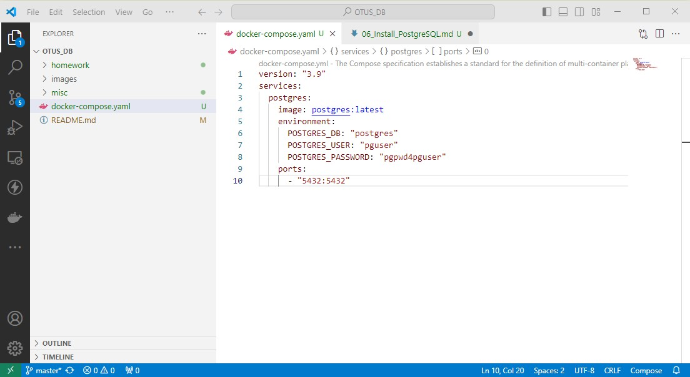
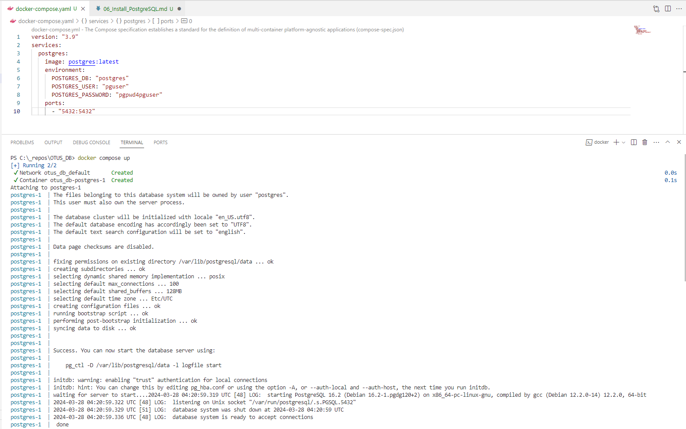
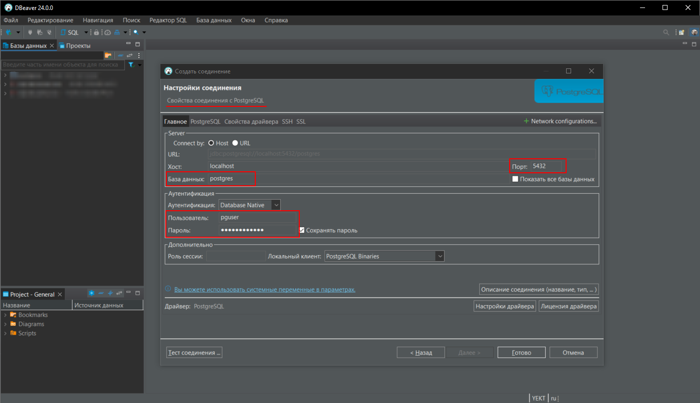
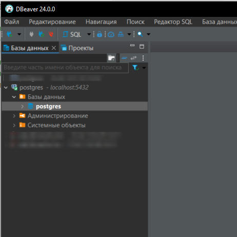
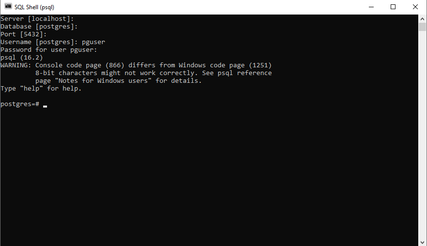

## Установка СУБД PostgreSQL

### Подготовка docker контейнера с PostgreSQL
Для удобства запуска СУБД PostgreSQL в целях разработки проще всего подготовить compose-файл, с помощью которого в дальнейшем будет запускаться docker-контейнер.
Самый простой вариант конфигурации контейнра содержит информацию и версии СУБД, имени БД по умолчанию, имя и пароль пользователя, а так же прокидываемый порт для подключения к СУБД. На данный момент это не нужно, но в дальнейшем будет полезно добавить монтирование волюма, на котором будут храниться файлы БД.

### Запуск контейнера с PostgreSQL 
После установки на машину docker, для запуска контейнера с PostgreSQL достаточно выполнить команду:

`docker compose up`

При этом docker делает инициализацию контейнера и базы данных с именем, указанным в compose файле.

### Подключение к СУБД через DBeaver
После установки и запуска DBeaver нужно добавить новое подключение к PostgreSQL, указав в параметрах имя БД, пользователя и пароль, указанные в compose-файле.

После успешного создания соединение с СУБД появится в списке доступных.

### Подключение к СУБД через консоль
После установки набора утилит управления СУБД, утилиту psql можно запустить:
* из меню Пуск -> SQL Shell (psql)
* напрямую исполняемый файл "C:\Program Files\PostgreSQL\16\bin\psql.exe"
Далее нужно указать адрес сервера СУБД, имя БД, порт, имя и пароль пользователя

