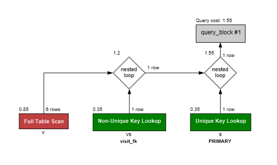

# Анализ и профилирование запроса MySQL
## Анализ запроса

Запрос выводит специалистов, визитов к которым было менее 10 за месяц. В таблице 

```sql
explain select s.surname, s.first_name, s.patronymic, count(v.id) as visits_count
from specialist s inner join visit_specialist vs
    on s.id = vs.specialist_fk 
inner join visit v
	on v.id = vs.visit_fk
where v.date between '2024-08-01 00:00:00' and '2024-09-31 23:59:59'
group by s.id
having visits_count < 10 \G
```

```
******************** 1. row *********************
           id: 1
  select_type: SIMPLE
        table: v
   partitions: 
         type: ALL
possible_keys: PRIMARY,id
          key: 
      key_len: 
          ref: 
         rows: 6
     filtered: 16.67
        Extra: Using where
******************** 2. row *********************
           id: 1
  select_type: SIMPLE
        table: vs
   partitions: 
         type: ref
possible_keys: visit_specialist_index_10,visit_fk
          key: visit_fk
      key_len: 5
          ref: medical_center.v.id
         rows: 1
     filtered: 100.00
        Extra: Using where
******************** 3. row *********************
           id: 1
  select_type: SIMPLE
        table: s
   partitions: 
         type: eq_ref
possible_keys: PRIMARY,id
          key: PRIMARY
      key_len: 4
          ref: medical_center.vs.specialist_fk
         rows: 1
     filtered: 100.00
        Extra: 
3 rows in set
```

Тот же план запроса в графическом виде



План запроса в формате JSON. Представлет собой древовидную структуру с довольно подробными данными о планировании запроса.

```sql
explain format=json select s.surname, s.first_name, s.patronymic, count(v.id) as visits_count
from specialist s inner join visit_specialist vs
    on s.id = vs.specialist_fk 
inner join visit v
	on v.id = vs.visit_fk
where v.date between '2024-08-01 00:00:00' and '2024-09-31 23:59:59'
group by s.id
having visits_count < 10;
```

```json
{
    "query_block": {
      "select_id": 1,
      "cost_info": {
        "query_cost": "1.55"
      },
      "grouping_operation": {
        "using_temporary_table": true,
        "using_filesort": false,
        "nested_loop": [
          {
            "table": {
              "table_name": "v",
              "access_type": "ALL",
              "possible_keys": [
                "PRIMARY",
                "id"
              ],
              "rows_examined_per_scan": 6,
              "rows_produced_per_join": 1,
              "filtered": "16.67",
              "cost_info": {
                "read_cost": "0.75",
                "eval_cost": "0.10",
                "prefix_cost": "0.85",
                "data_read_per_join": "2K"
              },
              "used_columns": [
                "id",
                "date"
              ],
              "attached_condition": "(`medical_center`.`v`.`date` between '2024-08-01 00:00:00' and '2024-09-31 23:59:59')"
            }
          },
          {
            "table": {
              "table_name": "vs",
              "access_type": "ref",
              "possible_keys": [
                "visit_specialist_index_10",
                "visit_fk"
              ],
              "key": "visit_fk",
              "used_key_parts": [
                "visit_fk"
              ],
              "key_length": "5",
              "ref": [
                "medical_center.v.id"
              ],
              "rows_examined_per_scan": 1,
              "rows_produced_per_join": 1,
              "filtered": "100.00",
              "cost_info": {
                "read_cost": "0.25",
                "eval_cost": "0.10",
                "prefix_cost": "1.20",
                "data_read_per_join": "1K"
              },
              "used_columns": [
                "id",
                "visit_fk",
                "specialist_fk"
              ],
              "attached_condition": "(`medical_center`.`vs`.`specialist_fk` is not null)"
            }
          },
          {
            "table": {
              "table_name": "s",
              "access_type": "eq_ref",
              "possible_keys": [
                "PRIMARY",
                "id",
                "specialist_index_0",
                "specialist_index_1",
                "idx_specialist_surname",
                "idx_specialist_speciality"
              ],
              "key": "PRIMARY",
              "used_key_parts": [
                "id"
              ],
              "key_length": "4",
              "ref": [
                "medical_center.vs.specialist_fk"
              ],
              "rows_examined_per_scan": 1,
              "rows_produced_per_join": 1,
              "filtered": "100.00",
              "cost_info": {
                "read_cost": "0.25",
                "eval_cost": "0.10",
                "prefix_cost": "1.55",
                "data_read_per_join": "4K"
              },
              "used_columns": [
                "id",
                "surname",
                "first_name",
                "patronymic"
              ]
            }
          }
        ]
      }
    }
  }
```


К сожалению мне так и не удалось получить план запроса с использованием параметра analyze. При этом MySQL выдаёт малопонятную ошибку и предлагает обратиться к документации, ссылаясь на ситексическую ошибку. В документации так же не удалось обнаружить причину невыполнения запроса. По моим наблюдениям в PostgreSQL значительно понятнее реализована обработка синтаксических ошибок.

```sql
explain analyze select s.surname, s.first_name, s.patronymic, count(v.id) as visits_count
from specialist s inner join visit_specialist vs
    on s.id = vs.specialist_fk 
inner join visit v
	on v.id = vs.visit_fk
where v.date between '2024-08-01 00:00:00' and '2024-09-31 23:59:59'
group by s.id
having visits_count < 10;
```


Анализируя полученные планы запросов можно сделать вывод, что самой тяжёлой частью является поиск по диапазону даты. Для облегчения данного поиска таблица была разбита на партиции, содержащие в себе данные по мясяцам. Не уверен, что добавление индекса по полю date даст серьёзный прирост производительности в этих условиях.